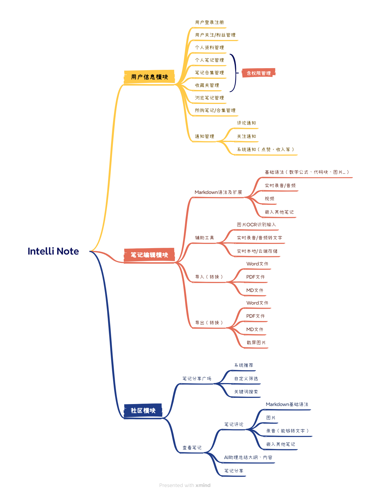

# Intelli Note Docs

1. 项目名称：Intelli Note（智能云笔记）
2. 小组的GitHub地址：https://github.com/intelli-note
3. 小组成员、分工及GitHub主页：

| 姓名   | 学号       | Github                        | 分工     |
| ------ | ---------- | ----------------------------- | -------- |
| 占巩乐 | 2112190218 | https://github.com/demiphea   | 服务端   |
| 姚欣   | 2112190213 | https://github.com/yukiyx     | 小程序端 |
| 周阳镠 | 2112190230 | https://github.com/zeroyl2023 | 小程序端 |

4. 程序功能描述

     - 用户可以注册并登录
     - 用户可以修改个人资料：头像、用户名等
     - 用户可以使用`Markdown`语法来编辑笔记，支持插入图片、视频、音频（包含即时录音）以及嵌入其他笔记
     - 用户可以通过图片`OCR`识别、录音转文字来输入笔记
     - 用户可以将`Word`文件、`PDF`文件以及`MD(Markdown)`文件一键导入笔记
     - 用户可以将笔记导出为`MD(Markdown)`文件、`Word`文件、`PDF`文件以及通过截屏获得的图片文件
     - 用户可以通过`AI`助理一键总结笔记大纲和内容
     - 用户可以对笔记进行评论，评论内容可以为部分`Markdown`语法特性的文字、图片、语音（待定）、笔记（链接导航组件形式）
     - 用户可以创建合集，可以将自己某一相同类的笔记进行收录
     - 用户可以创建收藏夹，可以对自己喜爱的笔记进行收藏
     - 用户可以设置笔记、合集和收藏夹的权限：公开/私有、免费/付费（收藏夹除外）
     - 用户可以分享笔记
     - 用户可以自定义筛选和搜索符合关键词的笔记
     - 用户可以查看系统推荐的笔记
     - 用户可以查看自己已浏览的笔记
     - 用户可以查看自己购买的笔记或合集
     - 用户可以关注其他用户，当其他用户发布笔记时将会收到通知
     - 用户可以查看评论、关注、系统（主要是评论点赞、收入）等相关通知

5. 思维导图

