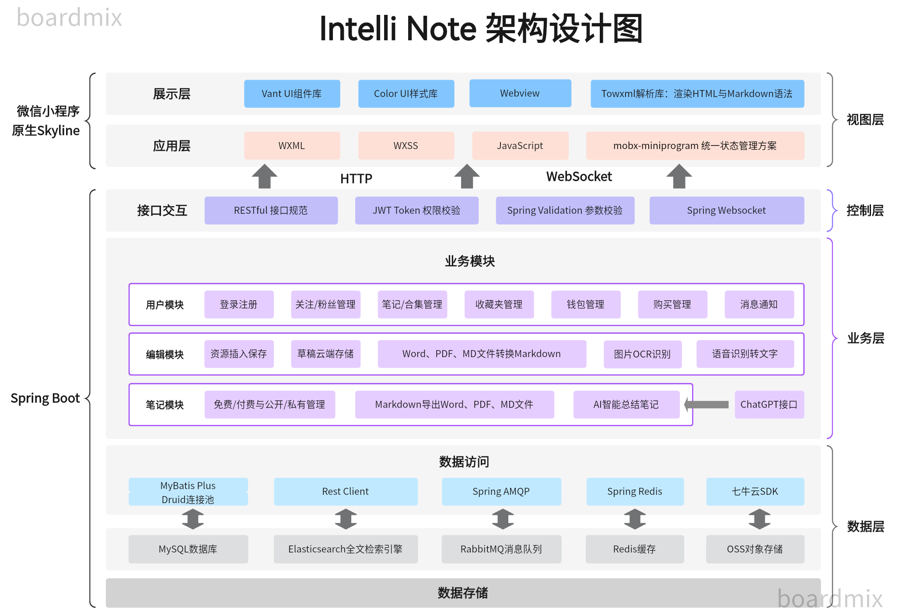

# 软件架构

1. 项目技术方案

|                         |                        技术方案                        |
| :---------------------: | :----------------------------------------------------: |
|          前端           | 微信小程序原生开发（基于JavaScript + Skyline渲染引擎） |
|          后端           |               Spring Boot + MyBatis Plus               |
|         数据库          |                         MySQL                          |
|      全文检索引擎       |                     Elasticsearch                      |
|        消息队列         |                        RabbitMQ                        |
|          缓存           |                         Redis                          |
|        对象存储         |                       七牛云OSS                        |
|       AI文本总结        |                  OpenAI Prompt提示词                   |
|       图片OCR识别       |                 微信官方API/第三方API                  |
|   语音识别（转文字）    |                 微信官方API/第三方API                  |
|    Markdown解析预览     |                      Towxml解析库                      |
|     Markdown编辑器      |     前端自主开发（优先）/Webview嵌入第三方开源组件     |
| Markdown与Word、PDF互转 |           后端自主开发（优先）/第三方开源库            |

2. 项目整体架构图

