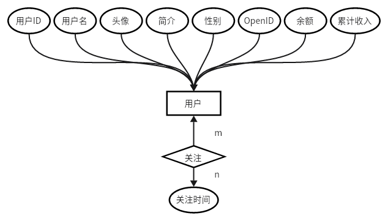
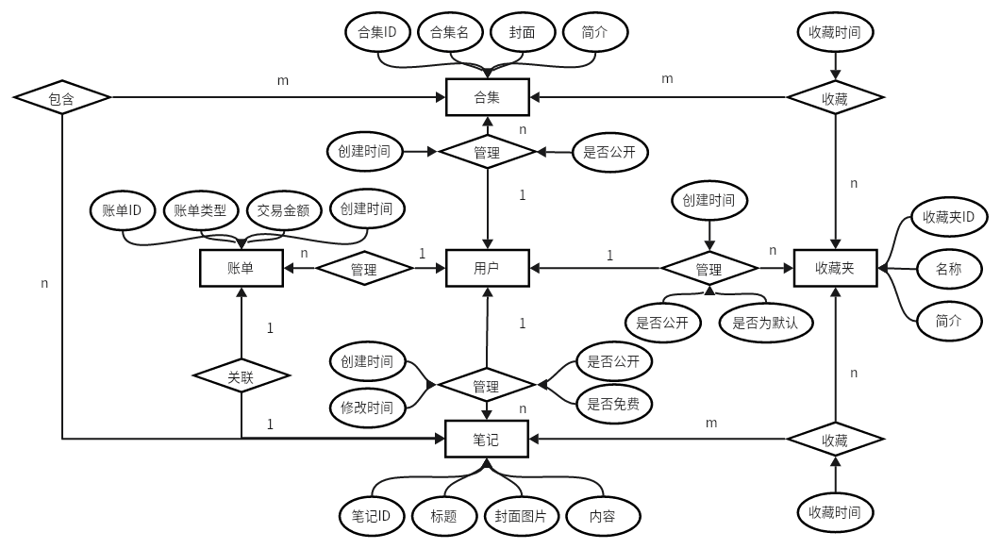
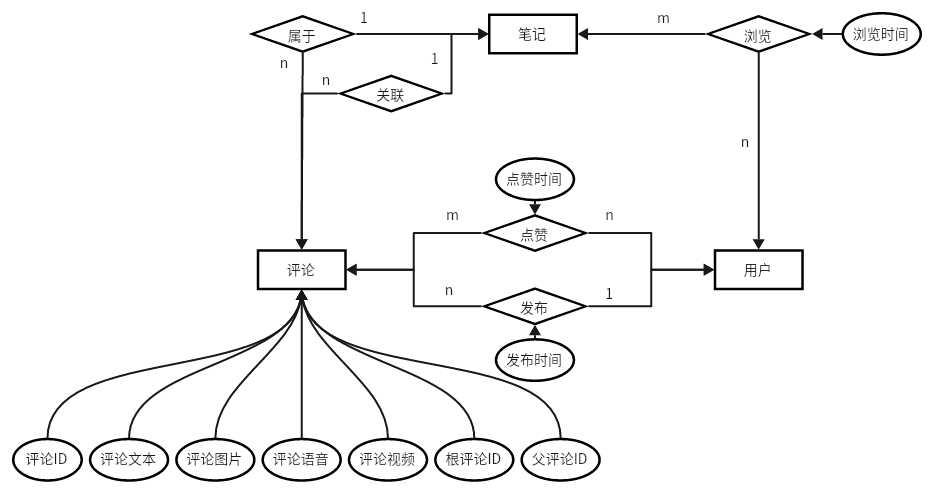
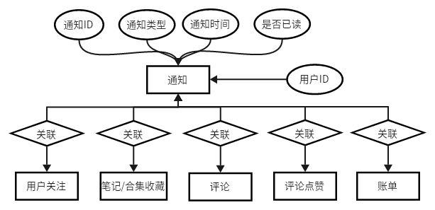
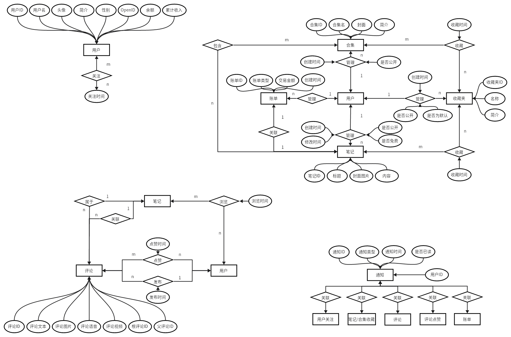

# Intelli Note 数据库设计文档

## 一、数据库选型

采用`MySQL`作为本项目的数据库。查询通义千问AI，其优点可分为如下几点：

- **开源免费**：MySQL是一个开源的关系型数据库管理系统，用户可以免费下载、安装和使用，这对于企业和个人开发者来说，能够显著降低项目开发的成本。
- **高性能与稳定性**：MySQL经过长期发展和优化，具备高度的性能和稳定性，即使在高并发、大数据量的情况下也能保持快速响应和较低的故障率。
- **广泛兼容性**：MySQL可在多种操作系统平台上运行，包括但不限于Linux、Windows、macOS等，并且提供了丰富的API接口，支持C、C++、PHP、Python、Java等多种开发语言，是Web开发中的黄金搭档。
- **灵活可扩展**：MySQL支持多种存储引擎，可以根据不同应用场景选择合适的引擎来优化性能，同时具备较好的水平扩展和垂直扩展能力，可以随着业务的增长而进行相应的架构调整。
- **功能齐全**：MySQL提供了完整的SQL支持，包括ACID事务、复杂查询、存储过程、触发器、视图等功能，足以应对各种复杂的数据管理需求。
- **社区支持与文档资源**：MySQL有一个庞大且活跃的全球开发者社区，这意味着丰富的学习资源、快速的问题解答和持续的技术更新，保证了用户在使用过程中能得到充分的技术支持。
- **数据安全**：MySQL支持SSL安全连接，通过设置合理的权限管理和备份策略，可以有效保障数据的安全性和完整性。
- **云服务便捷性**：MySQL也被各大云服务提供商集成，作为云数据库服务的一部分，可以轻松地部署在云端，享受到云服务带来的高可用性、弹性伸缩和自动化运维等优势。

## 二、概念结构设计（E-R图）

### 1、用户模块

在用户模块，围绕`用户`实体，需要存储用户的基本资料（用户名、头像等）。由于本项目为微信小程序应用，需要同步存储用户的`OpenID`属性。同时用户与用户之间存在`关注/被关注`的多对多的实体自联系。

### 2、主功能模块

在此模块中，体现了`用户`、`账单`、`笔记`、`合集`和`收藏夹`多个实体间的关系，`用户`作为核心。可以分为两个子模块：

- `用户`、`笔记`、`合集`与`收藏夹`子模块
  - 用户可以管理自己的笔记
  - 用户可以管理自己的合集，并且合集可以收录**自己**的笔记
  - 用户可以管理自己的收藏夹，并且收藏夹可以收录笔记和合集

- `用户`、`笔记`与`账单`子模块：
  - 用户可以管理自己的账单
  - 因购买付费笔记会创建账单，所以账单关联着付费的笔记

### 3、笔记模块

在此模块，主要是`用户`、`笔记`和`评论`几个实体的联系。

- 用户可以浏览笔记、发布/点赞评论
- 笔记可以有多个评论
- 评论可以关联其他笔记

注：评论的设计主要参考了[B站评论系统架构设计](https://mp.weixin.qq.com/s/s99ZWuSi0Lu6ivfpBHvLWQ)。

### 4、通知模块

在通知模块，主要存储用户收到的通知。可以分为五大类：

- 用户关注通知：`通知实体`关联`用户关注联系`
- 笔记/合集收藏通知：`通知实体`关联`用户收藏笔记/合集联系`
- 评论通知：`通知实体`关联`笔记评论联系`
- 评论点赞通知：`通知实体`关联`评论点赞联系`
- 账单通知：`通知实体`关联`账单实体`

### 5、总览

## 三、逻辑结构设计（表）

### 📚 数据库表目录

| 序号 | 表名                                        | 表说明         |
| :--: | :------------------------------------------ | :------------- |
|  1   | [bill](#bill)                               | 账单表         |
|  2   | [collection](#collection)                   | 合集表         |
|  3   | [collection_favorite](#collection_favorite) | 合集收藏表     |
|  4   | [comment_like](#comment_like)               | 评论点赞表     |
|  5   | [favorite](#favorite)                       | 收藏夹表       |
|  6   | [follow](#follow)                           | 关注表         |
|  7   | [note](#note)                               | 笔记表         |
|  8   | [note_collect](#note_collect)               | 合集收录表     |
|  9   | [note_favorite](#note_favorite)             | 笔记收藏表     |
|  10  | [notice](#notice)                           | 通知表         |
|  11  | [tb_comment](#tb_comment)                   | 评论表         |
|  12  | [tb_user](#tb_user)                         | 用户表         |
|  13  | [view_history](#view_history)               | 笔记查看历史表 |

### 📒 表结构

#### 表名： bill

说明： 账单表

| 序号 |    列名     | 数据类型 |  长度  | 主键 | 自增 | 允许空 | 默认值 | 列说明                                   |
| :--: | :---------: | :------: | :----: | :--: | :--: | :----: | :----: | :--------------------------------------- |
|  1   |     id      |  bigint  |        |  √   |      |        |        | 账单ID                                   |
|  2   |    type     |   int    |        |      |      |        |        | 账单类型：0-收入，1-支出，2-提现，3-充值 |
|  3   |   amount    | decimal  | (10,2) |      |      |        |        | 交易金额                                 |
|  4   | create_time | datetime |        |      |      |        |        | 创建时间                                 |
|  5   |   user_id   |  bigint  |        |      |      |        |        | 用户ID                                   |
|  6   |   note_id   |  bigint  |        |      |      |        |        | 关联笔记ID                               |
|  7   | is_deleted  | tinyint  |        |      |      |        |        | 是否逻辑删除                             |

#### 表名： collection

说明： 合集表

| 序号 |        列名        | 数据类型 | 长度  | 主键 | 自增 | 允许空 | 默认值 | 列说明                    |
| :--: | :----------------: | :------: | :---: | :--: | :--: | :----: | :----: | :------------------------ |
|  1   |         id         |  bigint  |       |  √   |      |        |        | 合集ID                    |
|  2   |       cname        | varchar  | (50)  |      |      |        |        | 名称，50字以内            |
|  3   |       cover        |   text   |  (0)  |      |      |   √    |        | 封面图片url，可以为空     |
|  4   | brief_introduction | varchar  | (255) |      |      |   √    |        | 简介，255字以内，可以为空 |
|  5   |      user_id       |  bigint  |       |      |      |        |        | 拥有者用户ID              |
|  6   |    create_time     | datetime |       |      |      |        |        | 创建时间                  |
|  7   |   is_open_public   | tinyint  |       |      |      |        |        | 是否公开                  |

#### 表名： collection_favorite

说明： 合集收藏表

| 序号 |     列名      | 数据类型 | 长度 | 主键 | 自增 | 允许空 | 默认值 | 列说明         |
| :--: | :-----------: | :------: | :--: | :--: | :--: | :----: | :----: | :------------- |
|  1   |      id       |  bigint  |      |  √   |      |        |        | 合集收藏联系ID |
|  2   | collection_id |  bigint  |      |      |      |        |        | 合集ID         |
|  3   |  favorite_id  |  bigint  |      |      |      |        |        | 收藏夹ID       |
|  4   |  create_time  | datetime |      |      |      |        |        | 收藏时间       |

#### 表名： comment_like

说明： 评论点赞表

| 序号 |    列名     | 数据类型 | 长度 | 主键 | 自增 | 允许空 | 默认值 | 列说明         |
| :--: | :---------: | :------: | :--: | :--: | :--: | :----: | :----: | :------------- |
|  1   |     id      |  bigint  |      |  √   |      |        |        | 评论点赞联系ID |
|  2   |   note_id   |  bigint  |      |      |      |        |        | 笔记ID         |
|  3   |   user_id   |  bigint  |      |      |      |        |        | 用户ID         |
|  4   | create_time | datetime |      |      |      |        |        | 点赞时间       |

#### 表名： favorite

说明： 收藏夹表

| 序号 |        列名        | 数据类型 | 长度  | 主键 | 自增 | 允许空 | 默认值 | 列说明                    |
| :--: | :----------------: | :------: | :---: | :--: | :--: | :----: | :----: | :------------------------ |
|  1   |         id         |  bigint  |       |  √   |      |        |        | 收藏夹ID                  |
|  2   |       fname        | varchar  | (50)  |      |      |        |        | 名称，50字以内            |
|  3   | brief_introduction | varchar  | (255) |      |      |   √    |        | 简介，255字以内，可以为空 |
|  4   |      user_id       |  bigint  |       |      |      |        |        | 拥有者用户ID              |
|  5   |    create_time     | datetime |       |      |      |        |        | 创建时间                  |
|  6   |  is_option_public  | tinyint  |       |      |      |        |        | 是否公开                  |
|  7   | is_option_default  | tinyint  |       |      |      |        |        | 是否为默认收藏夹          |

#### 表名： follow

说明： 关注表

| 序号 |    列名     | 数据类型 | 长度 | 主键 | 自增 | 允许空 | 默认值 | 列说明       |
| :--: | :---------: | :------: | :--: | :--: | :--: | :----: | :----: | :----------- |
|  1   |     id      |  bigint  |      |  √   |      |        |        | 关注联系ID   |
|  2   | follower_id |  bigint  |      |      |      |        |        | 当前用户ID   |
|  3   |  follow_id  |  bigint  |      |      |      |        |        | 被关注用户ID |
|  4   | create_time | datetime |      |      |      |        |        | 关注时间     |

#### 表名： note

说明： 笔记表

| 序号 |      列名      | 数据类型 |  长度  | 主键 | 自增 | 允许空 | 默认值 | 列说明                |
| :--: | :------------: | :------: | :----: | :--: | :--: | :----: | :----: | :-------------------- |
|  1   |       id       |  bigint  |        |  √   |      |        |        | 笔记ID                |
|  2   |     title      | varchar  |  (50)  |      |      |        |        | 标题，50字以内        |
|  3   |     cover      |   text   |  (0)   |      |      |   √    |        | 封面图片url，可以为空 |
|  4   |    content     | longtext |        |      |      |        |        | 内容                  |
|  5   |    user_id     |  bigint  |        |      |      |        |        | 作者，用户ID          |
|  6   |  create_time   | datetime |        |      |      |        |        | 创建时间              |
|  7   |  update_time   | datetime |        |      |      |        |        | 修改时间              |
|  8   | is_open_public | tinyint  |        |      |      |        |        | 是否公开              |
|  9   |     price      | decimal  | (10,2) |      |      |   √    |        | 价格，免费为null 0    |

#### 表名： note_collect

说明： 合集收录表

| 序号 |     列名      | 数据类型 | 长度 | 主键 | 自增 | 允许空 | 默认值 | 列说明 |
| :--: | :-----------: | :------: | :--: | :--: | :--: | :----: | :----: | :----- |
|  1   |    note_id    |  bigint  |      |  √   |      |        |        | 笔记ID |
|  2   | collection_id |  bigint  |      |  √   |      |        |        | 合集ID |

#### 表名： note_favorite

说明： 笔记收藏表

| 序号 |    列名     | 数据类型 | 长度 | 主键 | 自增 | 允许空 | 默认值 | 列说明         |
| :--: | :---------: | :------: | :--: | :--: | :--: | :----: | :----: | :------------- |
|  1   |     id      |  bigint  |      |  √   |      |        |        | 笔记收藏联系ID |
|  2   |   note_id   |  bigint  |      |      |      |        |        | 笔记ID         |
|  3   | favorite_id |  bigint  |      |      |      |        |        | 收藏夹ID       |
|  4   | create_time | datetime |      |      |      |        |        | 收藏时间       |

#### 表名： notice

说明： 通知表

| 序号 |          列名           | 数据类型 | 长度 | 主键 | 自增 | 允许空 | 默认值 | 列说明                                                       |
| :--: | :---------------------: | :------: | :--: | :--: | :--: | :----: | :----: | :----------------------------------------------------------- |
|  1   |           id            |  bigint  |      |  √   |      |        |        | 通知ID                                                       |
|  2   |          type           |  bigint  |      |      |      |        |        | 通知类型：0-关注通知，1-收藏通知，2-评论通知，3-点赞通知，4-交易通知 |
|  3   |     link_follow_id      |  bigint  |      |      |      |   √    |        | 关联关注表ID，可选                                           |
|  4   |    link_star_note_id    |  bigint  |      |      |      |   √    |        | 关联笔记收藏表ID，可选                                       |
|  5   | link_star_collection_id |  bigint  |      |      |      |   √    |        | 关联合集收藏表ID，可选                                       |
|  6   |     link_comment_id     |  bigint  |      |      |      |   √    |        | 关联评论表ID，可选                                           |
|  7   |  link_comment_like_id   |  bigint  |      |      |      |   √    |        | 关联评论点赞表ID，可选                                       |
|  8   |      link_bill_id       |  bigint  |      |      |      |   √    |        | 关联账单ID，可选                                             |
|  9   |         user_id         |  bigint  |      |      |      |        |        | 用户ID                                                       |
|  10  |       create_time       | datetime |      |      |      |        |        | 通知时间                                                     |
|  11  |         is_read         | tinyint  |      |      |      |        |        | 是否已读                                                     |

#### 表名： tb_comment

说明： 评论表

| 序号 |     列名     | 数据类型 | 长度 | 主键 | 自增 | 允许空 | 默认值 | 列说明             |
| :--: | :----------: | :------: | :--: | :--: | :--: | :----: | :----: | :----------------- |
|  1   |      id      |  bigint  |      |  √   |      |        |        | 评论ID             |
|  2   |   content    |   text   | (0)  |      |      |   √    |        | 评论文本，可选     |
|  3   |  image_list  |   text   | (0)  |      |      |   √    |        | 评论图片列表，可选 |
|  4   |    audio     |   text   | (0)  |      |      |   √    |        | 音频url，可选      |
|  5   |    video     |   text   | (0)  |      |      |   √    |        | 视频url，可选      |
|  6   | link_note_id |  bigint  |      |      |      |   √    |        | 关联笔记ID，可选   |
|  7   |   note_id    |  bigint  |      |      |      |        |        | 所属笔记ID         |
|  8   |   root_id    |  bigint  |      |      |      |   √    |        | 根评论ID           |
|  9   |  parent_id   |  bigint  |      |      |      |   √    |        | 父评论ID           |
|  10  |   user_id    |  bigint  |      |      |      |        |        | 用户ID             |
|  11  | create_time  | datetime |      |      |      |        |        | 评论时间           |

#### 表名： tb_user

说明： 用户表

| 序号 |   列名    | 数据类型 |  长度  | 主键 | 自增 | 允许空 | 默认值 | 列说明                                 |
| :--: | :-------: | :------: | :----: | :--: | :--: | :----: | :----: | :------------------------------------- |
|  1   |    id     |  bigint  |        |  √   |      |        |        | 用户ID                                 |
|  2   | username  | varchar  |  (20)  |      |      |        |        | 用户名，20字符内                       |
|  3   |  avatar   |   text   |  (0)   |      |      |        |        | 用户头像url                            |
|  4   | biography | varchar  | (255)  |      |      |   √    |        | 用户简介，255字符内，可为空            |
|  5   |  gender   | tinyint  |        |      |      |   √    |        | 性别：null-未知，true-男生，false-女生 |
|  6   |  openid   | varchar  | (130)  |      |      |        |        | 用户微信OpenID，不可重复               |
|  7   |  balance  | decimal  | (10,2) |      |      |        |        | 余额                                   |
|  8   |  revenue  | decimal  | (10,2) |      |      |        |        | 收入                                   |

#### 表名： view_history

说明： 笔记查看历史表

| 序号 |    列名     | 数据类型 | 长度 | 主键 | 自增 | 允许空 | 默认值 | 列说明   |
| :--: | :---------: | :------: | :--: | :--: | :--: | :----: | :----: | :------- |
|  1   |   user_id   |  bigint  |      |  √   |      |        |        | 用户ID   |
|  2   |   note_id   |  bigint  |      |  √   |      |        |        | 笔记ID   |
|  3   | create_time | datetime |      |      |      |        |        | 查看时间 |

## 四、数据库版本管理

采用`Flyway`数据库版本管理工具，可以实现管理并跟踪数据库变更，支持数据库版本自动升级，而且不需要复杂的配置，能够帮助团队更加方便、合理的管理数据库变更。具有以下优点：

- **简单**：非常容易安装和学习，同时迁移的方式也很容易被开发者接受。
- **专一**：专注于数据库迁移、版本控制而并没有其它副作用。
- **强大**：专为连续交付而设计。让Flyway在应用程序启动时迁移数据库。

参考资料：

1. [快速学会像Git一样管理数据库业务版本变更-腾讯云开发者社区-腾讯云 (tencent.com)](https://cloud.tencent.com/developer/article/1551585)
2. [Flyway详解（使用说明及避坑指南、一文搞懂flyway）-CSDN博客](https://blog.csdn.net/Jiao1225/article/details/129590660)
3. [Spring Boot 集成 Flyway 实现数据库版本控制 - 知乎 (zhihu.com)](https://zhuanlan.zhihu.com/p/138825099)

## 五、其他数据库相关

### 1、ElasticSearch

由于本项目中主要以“笔记”为核心，所以避免不了对笔记进行**搜索**。`Elasticsearch`作为基于`Lucene`构建的全文搜索引擎，专为实现快速、准确的全文本搜索而设计，它可以对大量文本数据进行高效索引和搜索，支持复杂的查询条件，如模糊搜索、短语匹配、布尔逻辑组合查询等。

### 2、MyBatis Plus

本项目采用`MyBatis Plus`框架进行数据库持久层开发。`MyBatis Plus`是在`MyBatis`的基础上封装的一套高效、便捷的增强工具，在保留`MyBatis`所有特性的同时，增加了许多非常实用的功能，例如无侵入的通用CRUD操作、强大的条件构造器、分页插件、逻辑删除、全局序列号生成等，极大提高了开发效率和代码简洁度。

### 3、Redis缓存

本项目采用`Spring Cache`结合`Redis`实现缓存。`Redis`是一个内存数据库，所有的数据都存储在内存中，这意味着其读写速度极快，相比磁盘存储的传统数据库有数量级的性能优势。因此，作为缓存，`Redis`能够显著降低数据库的访问压力，提高整个系统的响应速度。
